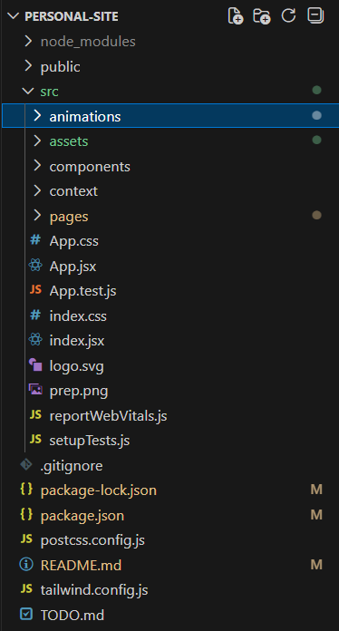

# Mmeli Gabriel Dyantyi — Portfolio


A modern, single‑page portfolio built with **React + Vite**, designed in a black-midnight-deep-ocean theme to reflect my engineering identity:  
**Systems Development • Cloud Engineering • DevOps Automation • Full‑stack Architecture**

---

## Live Features
- Smooth‑scroll single‑page layout  
- Fixed navbar (orange branding)  
- Hero section with bold identity  
- About section with engineering focus  
- Projects grid (cloud, systems, full‑stack)  
- Contact section (email + location)  
- Responsive + minimal + high‑contrast UI  

---

## Tech Stack


**DevOps / Cloud**


---

## Project Structure




---

## Setup

```
npm install;
npm run dev;
npm run build;
```


---

##  Deployment

**Vercel**  
Build output: `dist`
[Live](mmeligabriel.online)
---

## 📄 License

MIT
